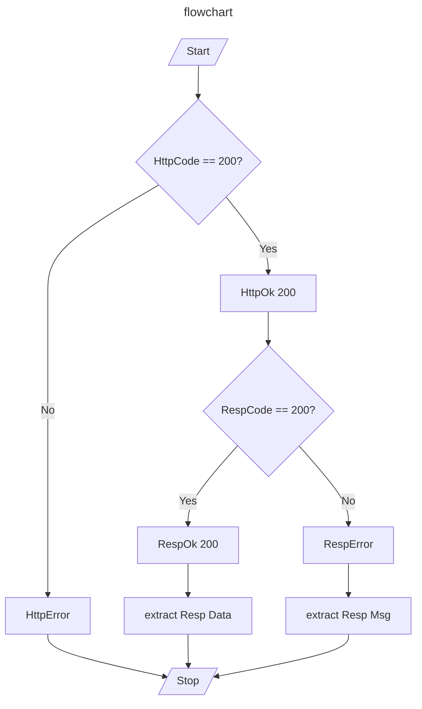

# best-practice

<a href="./docs/README.zh-CH.md">中文文档</a>

This repo demonstrates the best practice in own work， including:

- backend response in restful style;

## Backend Response in Restful Style

1. distinguish http status;
2. distinguish response body code;
3. response body code != 200, extract response body message to show;
4. response body code == 200, extract response body data to render;

## Bean Validation
