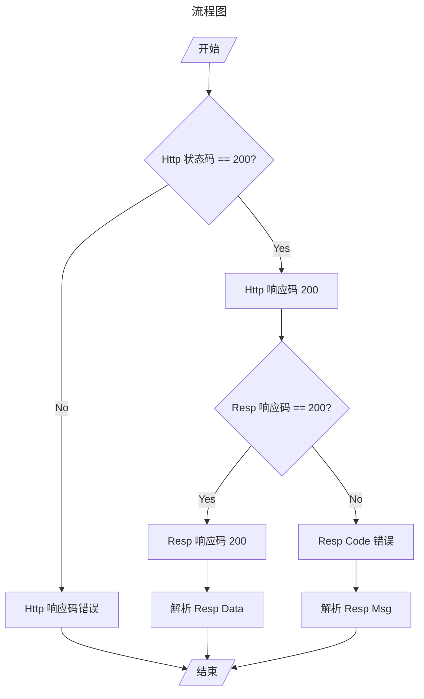
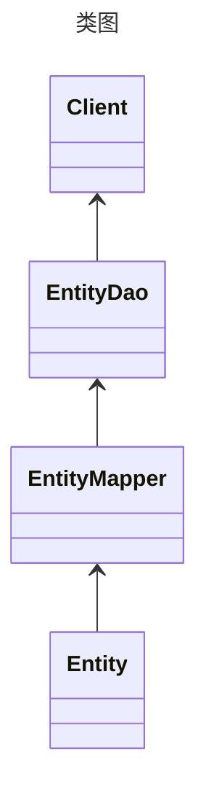

# 最佳实践

这个仓库用来演示工作中的最佳实践，包括：

- Restful 风格的后端响应；
- ORM 设计；

## Restful 风格的后端响应

1. 通过 HTTP 状态码来区分响应的大类；
2. 通过 Response 中 Body 的 code 字段来区分业务定义错误和服务内部错误；
3. code != 200，则解析 message 展示错误信息；
4. code == 200，则解析 data 字段，获取响应数据；



## ORM 设计

目的是将 ORM 整合到 springboot 中。 

### 核心依赖

```xml
<!-- mysql 驱动 -->
<dependency>
    <groupId>com.mysql</groupId>
    <artifactId>mysql-connector-j</artifactId>
    <scope>runtime</scope>
</dependency>

<!-- druid 数据源（可替换） -->
<dependency>
    <groupId>com.alibaba</groupId>
    <artifactId>druid-spring-boot-starter</artifactId>
</dependency>

<!-- ORM 框架（可替换） -->
<dependency>
    <groupId>com.baomidou</groupId>
    <artifactId>mybatis-plus-boot-starter</artifactId>
    <version>${mybatis-plus}</version>
</dependency>

<!-- 对 sql 脚本进行版本控制 -->
<dependency>
    <groupId>org.flywaydb</groupId>
    <artifactId>flyway-core</artifactId>
</dependency>

<!-- flyway 对 mysql 的插件支持 -->
<dependency>
    <groupId>org.flywaydb</groupId>
    <artifactId>flyway-mysql</artifactId>
</dependency>
```

### 数据库 DDL 规范

1. 表名、字段名使用小写字母或数字，中间用下划线隔开；
2. 库名与应用名一致，表名遵循“业务名称_表的作用”，表名不用复数；
3. id 字段，类型为 bigint、create_time、update_time 字段，类型 datetime 是必须的，逻辑删除 is_deleted 是可选的；
4. 表达是与否，字段使用 is_xxx 方式命名，使用 tinyint 类型。1 表示是，0 表示否；
5. 小数类型使用 decimal；
6. 主键索引名为 pk\_字段名，唯一索引名为 uk\_字段名，普通索引名为 idx\_字段名；

### SQL 脚本版本控制

#### 配置 sql 执行位置

```yaml
flyway:
  locations: db/migration
```

#### 命名规则

**V**版本号__描述.sql

### 核心组件



#### Entity 

与数据表一一对应。

#### EntityMapper

对 Entity 进行了 Mapper 层包装，为 EntityDao 提供更丰富的 CRUD 支持。

Mapper 可以对应一个 mapper.xml 文件。

#### EntityDao

是 Client 访问数据库的唯一接口。

#### Client

客户端。

### 逻辑删除

TableLogic 注解用来标识逻辑删除字段。

```java
/**
 * 逻辑删除
 */
@TableField(value = "is_deleted")
@TableLogic
private boolean deleted;
```

[文档](https://www.baomidou.com/pages/6b03c5/)

### 自动填充

参考 MyMetaObjectHandler

[文档](https://www.baomidou.com/pages/4c6bcf/)

### 通用枚举

EnumValue 注解用来标记数据库存储的值。

[文档](https://www.baomidou.com/pages/8390a4/)
