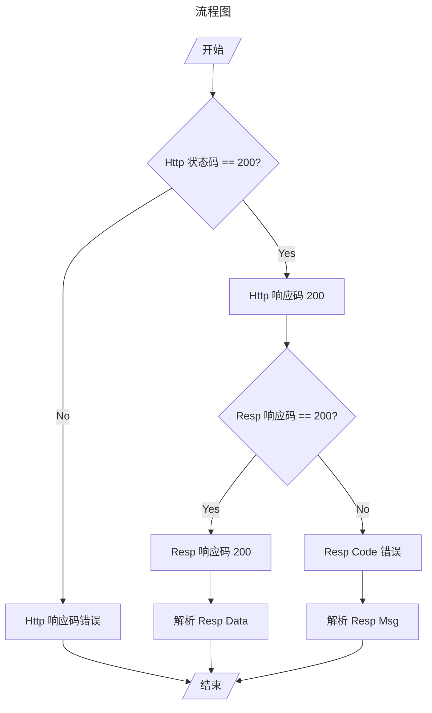

# 最佳实践

这个仓库用来演示工作中的最佳实践，包括：

- Restful 风格的后端响应；

## Restful 风格的后端响应

1. 通过 HTTP 状态码来区分响应的大类；
2. 通过 Response 中 Body 的 code 字段来区分业务定义错误和服务内部错误；
3. code != 200，则解析 message 展示错误信息；
4. code == 200，则解析 data 字段，获取响应数据；

